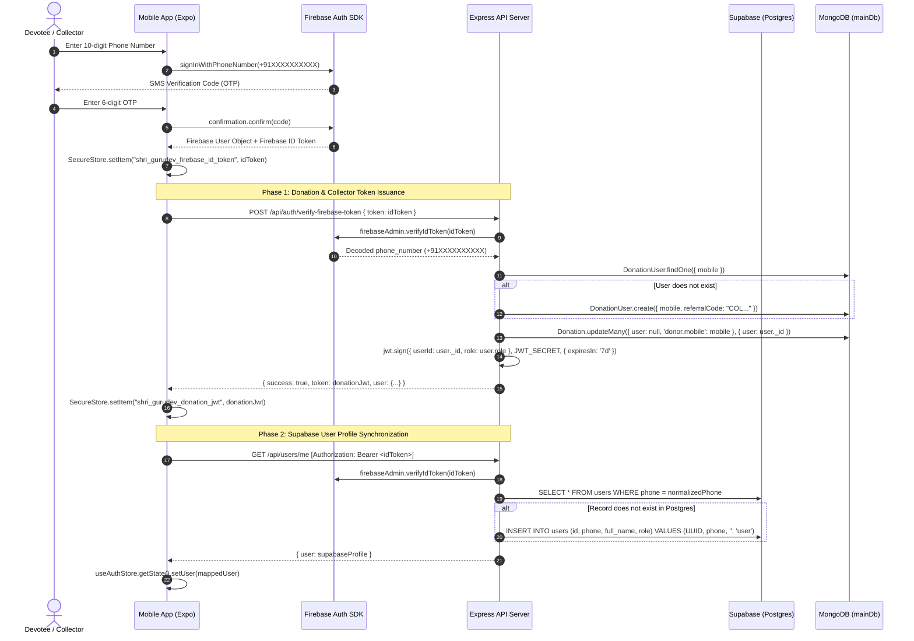

# Shri Gurudev Ashram App — Project Status & Technical Audit

**Audit Date:** 2026-09-12  
**Auditor:** Antigravity Pairing Agent  
**Target Repository:** `alee-06/shri-gurudev-ashram-app`  
**Execution Environment:** Windows (x64) · Node v24.12.0 · npm 11.6.2 · Expo SDK ~56.0.19  

---

## 1. Project Architecture

### Frontend Technology
- **Framework:** React Native 0.85.3 with Expo ~56.0.19 and React 19.2.3.
- **Routing:** Expo Router ~56.2.18 (File-based routing under [`app/`](file:///c:/Users/abuna/Desktop/proj/shri-gurudev-ashram-app/app)).
- **Styling:** NativeWind 4.2.4 with Tailwind CSS 3.4.19 and `react-native-css-interop` 0.2.4.
- **State Management:** Zustand 5.0.13 ([`src/store/useAuthStore.ts`](file:///c:/Users/abuna/Desktop/proj/shri-gurudev-ashram-app/src/store/useAuthStore.ts), [`src/store/useBookingDraftStore.ts`](file:///c:/Users/abuna/Desktop/proj/shri-gurudev-ashram-app/src/store/useBookingDraftStore.ts), [`src/store/useSevaStore.ts`](file:///c:/Users/abuna/Desktop/proj/shri-gurudev-ashram-app/src/store/useSevaStore.ts)) + TanStack React Query 5.100.13 ([`src/api/queryClient.ts`](file:///c:/Users/abuna/Desktop/proj/shri-gurudev-ashram-app/src/api/queryClient.ts)).
- **Storage:** `expo-secure-store` ~56.0.4 with web `localStorage` fallback ([`src/services/auth.ts`](file:///c:/Users/abuna/Desktop/proj/shri-gurudev-ashram-app/src/services/auth.ts)).
- **Hardware/Native Capabilities:** `react-native-razorpay` 3.0.0, `@react-native-firebase/auth` 25.1.0, `expo-image-picker` ~56.0.23, `expo-notifications` ~56.0.23, `expo-print` ~56.0.4.

### Backend Technology
- **Runtime:** Node.js v24 with TypeScript ~6.0.3, executed using `tsx` 4.22+ ([`backend/package.json`](file:///c:/Users/abuna/Desktop/proj/shri-gurudev-ashram-app/backend/package.json)).
- **Web Framework:** Express 5.2.1 with middleware `helmet` 8.1.0, `cors` 2.8.5, and `express-rate-limit` 8.2.1 ([`backend/src/app.ts`](file:///c:/Users/abuna/Desktop/proj/shri-gurudev-ashram-app/backend/src/app.ts)).
- **PDF Generation:** PDFKit 0.17.2 ([`backend/src/services/donationReceipt.ts`](file:///c:/Users/abuna/Desktop/proj/shri-gurudev-ashram-app/backend/src/services/donationReceipt.ts)).
- **File Uploads:** Multer 2.1.1 configured for memory and local disk storage ([`backend/src/middleware/upload.ts`](file:///c:/Users/abuna/Desktop/proj/shri-gurudev-ashram-app/backend/src/middleware/upload.ts)).

### Database Architecture (Dual Database Model)
1. **Supabase (PostgreSQL 15+) via `@supabase/supabase-js` 2.110.8**:
   - Manages legacy travel packages, passenger lists, travel bookings, Supabase user profiles, general Seva packages, and webhook event deduplication.
   - Admin access configured via `supabaseAdmin` service-role client ([`backend/src/services/supabaseAdmin.ts`](file:///c:/Users/abuna/Desktop/proj/shri-gurudev-ashram-app/backend/src/services/supabaseAdmin.ts)).
2. **MongoDB (Mongoose 9.0.2)**:
   - Utilizes two distinct connection handles in [`backend/src/services/mongo.ts`](file:///c:/Users/abuna/Desktop/proj/shri-gurudev-ashram-app/backend/src/services/mongo.ts):
     - `mainDb` (`MONGO_URI`): Manages `Donation` records, `DonationUser` profiles, and `NityaAnnadanBooking` records.
     - `sharedDb` (`MONGO_URI_SHARED`): Manages the `DonationHead` (donation cause catalog) shared with the public website.

### Authentication Architecture (Dual Token Model)
- **Primary Credential:** Firebase Phone Authentication (SMS OTP) via `@react-native-firebase/auth`.
- **Backend Verification:** `firebase-admin` 13.7.0 verifies ID tokens ([`backend/src/services/firebaseAdmin.ts`](file:///c:/Users/abuna/Desktop/proj/shri-gurudev-ashram-app/backend/src/services/firebaseAdmin.ts)).
- **Session Token 1 (Travel/Seva/Profile):** Firebase ID Token sent in `Authorization: Bearer <token>` to [`backend/src/middleware/auth.ts`](file:///c:/Users/abuna/Desktop/proj/shri-gurudev-ashram-app/backend/src/middleware/auth.ts).
- **Session Token 2 (Donations/Collectors):** Custom signed JWT (`jsonwebtoken` 9.0.3) issued by [`backend/src/routes/donationAuth.ts`](file:///c:/Users/abuna/Desktop/proj/shri-gurudev-ashram-app/backend/src/routes/donationAuth.ts), stored in SecureStore under `shri_gurudev_donation_jwt`, and sent via [`src/api/donationAxiosClient.ts`](file:///c:/Users/abuna/Desktop/proj/shri-gurudev-ashram-app/src/api/donationAxiosClient.ts) to [`backend/src/middleware/donationAuth.ts`](file:///c:/Users/abuna/Desktop/proj/shri-gurudev-ashram-app/backend/src/middleware/donationAuth.ts).

### Payment Gateway
- **Provider:** Razorpay (`razorpay` 2.9.6 Node SDK backend + `react-native-razorpay` 3.0.0 frontend).
- **Environment:** Currently operating with Test Keys (`rzp_test_...`).
- **Webhooks:** Managed at `POST /api/webhooks/razorpay` with HMAC-SHA256 signature verification and event ID deduplication.

### Deployment & Distribution
- **Mobile Distribution:** EAS Build (`eas.json`) with Android package `com.shrigurudevashram.app`.
- **Backend Hosting:** No Dockerfile, CI/CD pipeline, or production cloud deployment configuration present. Tested locally via `tsx` on port 3000.

### Major Modules
1. **Donations & Causes:** End-to-end multi-step donation workflow, dynamic cause selection, PAN/tax validation, and Razorpay payment.
2. **Collector System:** Collector registration with KYC (PAN + Aadhaar upload), status tracking, referral code attribution, digital ID badge, and leaderboard.
3. **Nitya Annadan Seva:** Dedicated Annadan booking flow with encrypted donor identity and Razorpay order integration.
4. **Travel & Yatra Packages (Legacy):** Package listings, seat inventory management, multi-passenger booking drafts, and payment verification.
5. **General Seva / Yajman Bookings (Legacy):** Yajman and ritual bookings stored in Supabase with calendar availability.
6. **Admin Portal (Backend Only):** REST endpoints for collector approvals, cash donations, and donation head catalog management.

---

## 2. Implemented Features

| Feature | Relevant Files | Backend/API Involved | Database Involved | Status | Evidence |
| :--- | :--- | :--- | :--- | :--- | :--- |
| **Phone OTP Login** | [`app/(auth)/login.tsx`](file:///c:/Users/abuna/Desktop/proj/shri-gurudev-ashram-app/app/(auth)/login.tsx)<br>[`src/services/auth.ts`](file:///c:/Users/abuna/Desktop/proj/shri-gurudev-ashram-app/src/services/auth.ts) | `POST /api/auth/verify-firebase-token`<br>`GET /api/users/me` | Supabase `users`<br>MongoDB `users` | **COMPLETE** | Firebase phone OTP initiates session; backend verifies token, links records in both DBs, and issues dual JWTs. |
| **Donation Cause Catalog** | [`src/screens/donation/DonationScreen.tsx`](file:///c:/Users/abuna/Desktop/proj/shri-gurudev-ashram-app/src/screens/donation/DonationScreen.tsx)<br>[`src/services/donation.ts`](file:///c:/Users/abuna/Desktop/proj/shri-gurudev-ashram-app/src/services/donation.ts) | `GET /api/public/donation-heads` | MongoDB `sharedDb.donationheads` | **COMPLETE** | React Query fetches active causes; displays names, descriptions, images, and preset amounts dynamically. |
| **Donation Creation & Validation** | [`src/screens/donation/DonationScreen.tsx`](file:///c:/Users/abuna/Desktop/proj/shri-gurudev-ashram-app/src/screens/donation/DonationScreen.tsx)<br>[`backend/src/controllers/donations.ts`](file:///c:/Users/abuna/Desktop/proj/shri-gurudev-ashram-app/backend/src/controllers/donations.ts) | `POST /api/donations/create` | MongoDB `mainDb.donations` | **COMPLETE** | Validates PAN regex, 18+ age check, amount >= 10, creates document with `status: 'PENDING'` and `receiptToken`. |
| **Collector Referral Attribution** | [`src/screens/donation/DonationScreen.tsx`](file:///c:/Users/abuna/Desktop/proj/shri-gurudev-ashram-app/src/screens/donation/DonationScreen.tsx)<br>[`backend/src/controllers/donations.ts`](file:///c:/Users/abuna/Desktop/proj/shri-gurudev-ashram-app/backend/src/controllers/donations.ts) | Passed in `POST /api/donations/create` (`referralCode`) | MongoDB `users` & `donations` | **PARTIAL** | Functional if donor types code manually in step 1. No QR scanner, no deep link ingestion, no auto-attribution for logged-in collectors. |
| **Razorpay Online Donation Payment** | [`src/screens/donation/DonationScreen.tsx`](file:///c:/Users/abuna/Desktop/proj/shri-gurudev-ashram-app/src/screens/donation/DonationScreen.tsx)<br>[`backend/src/controllers/donations.ts`](file:///c:/Users/abuna/Desktop/proj/shri-gurudev-ashram-app/backend/src/controllers/donations.ts) | `POST /api/donations/create-order`<br>`POST /api/donations/verify-payment` | MongoDB `donations` | **COMPLETE** | Backend creates Razorpay order, native checkout opens, and backend verifies HMAC-SHA256 signature before setting `SUCCESS`. |
| **Receipt Generation** | [`backend/src/services/donationReceipt.ts`](file:///c:/Users/abuna/Desktop/proj/shri-gurudev-ashram-app/backend/src/services/donationReceipt.ts)<br>[`backend/src/controllers/donations.ts`](file:///c:/Users/abuna/Desktop/proj/shri-gurudev-ashram-app/backend/src/controllers/donations.ts) | Triggered upon payment verification or webhook | Local filesystem (`backend/receipts`) | **PARTIAL** | PDF generates via PDFKit with receipt number, but stored on ephemeral local disk. Returns relative path `/receipts/...`. |
| **Receipt Download on Mobile** | [`app/donation-history.tsx`](file:///c:/Users/abuna/Desktop/proj/shri-gurudev-ashram-app/app/donation-history.tsx)<br>[`app/donation-success.tsx`](file:///c:/Users/abuna/Desktop/proj/shri-gurudev-ashram-app/app/donation-success.tsx) | `GET /api/donations/:id/receipt`<br>Static `/receipts/...` | N/A | **BROKEN** | History calls `Linking.openURL(item.receiptUrl)` with relative URL `/receipts/receipt_<id>.pdf`, failing on mobile devices. Success screen lacks download button. |
| **Donation History** | [`app/donation-history.tsx`](file:///c:/Users/abuna/Desktop/proj/shri-gurudev-ashram-app/app/donation-history.tsx)<br>[`src/services/donation.ts`](file:///c:/Users/abuna/Desktop/proj/shri-gurudev-ashram-app/src/services/donation.ts) | `GET /api/donations/history` | MongoDB `donations` | **PARTIAL** | Lists past contributions with status badges and search/filter. Receipt download broken. |
| **Collector KYC Application** | [`app/collector-apply.tsx`](file:///c:/Users/abuna/Desktop/proj/shri-gurudev-ashram-app/app/collector-apply.tsx)<br>[`backend/src/controllers/collector.ts`](file:///c:/Users/abuna/Desktop/proj/shri-gurudev-ashram-app/backend/src/controllers/collector.ts) | `POST /api/collector/apply`<br>`POST /api/collector/reapply` | MongoDB `users`<br>Local disk (`private_storage/kyc`) | **PARTIAL** | Multi-part form uploads Aadhaar front/back and PAN; sets `COLLECTOR_PENDING`. Files saved to ephemeral disk; no retrieval API. |
| **Collector Dashboard** | [`app/collector-dashboard.tsx`](file:///c:/Users/abuna/Desktop/proj/shri-gurudev-ashram-app/app/collector-dashboard.tsx)<br>[`backend/src/controllers/collector.ts`](file:///c:/Users/abuna/Desktop/proj/shri-gurudev-ashram-app/backend/src/controllers/collector.ts) | `GET /api/collector/dashboard`<br>`GET /api/collector/status` | MongoDB `donations` aggregation | **PARTIAL** | Displays metrics, referral code, and recent donations. "Share" and "Download" trigger alert stubs. Analytics icon dead. No in-person collection button. |
| **Digital ID Card Modal** | [`src/components/CollectorIDCard.tsx`](file:///c:/Users/abuna/Desktop/proj/shri-gurudev-ashram-app/src/components/CollectorIDCard.tsx)<br>[`app/collector-dashboard.tsx`](file:///c:/Users/abuna/Desktop/proj/shri-gurudev-ashram-app/app/collector-dashboard.tsx) | Client-rendered | MongoDB `users` | **COMPLETE** | Modal renders official digital ID badge with Ashram branding, photo/avatar, collector ID, and role. |
| **Cash / Offline Collection** | [`backend/src/routes/donationAdmin.ts`](file:///c:/Users/abuna/Desktop/proj/shri-gurudev-ashram-app/backend/src/routes/donationAdmin.ts) | `POST /api/admin/system/donations/cash` | MongoDB `donations` | **BROKEN** | Restricted to `SYSTEM_ADMIN` / `WEBSITE_ADMIN`. No mobile UI exists; approved collectors cannot record offline cash donations. |
| **Admin Portal** | [`backend/src/routes/donationAdmin.ts`](file:///c:/Users/abuna/Desktop/proj/shri-gurudev-ashram-app/backend/src/routes/donationAdmin.ts)<br>[`backend/src/routes/sevaPackagesAdmin.ts`](file:///c:/Users/abuna/Desktop/proj/shri-gurudev-ashram-app/backend/src/routes/sevaPackagesAdmin.ts) | 15 routes under `/api/admin/*` | MongoDB & Supabase | **BROKEN** | 100% missing on mobile frontend. Zero screens, routes, or API callers exist in the client codebase. |
| **Razorpay Webhooks** | [`backend/src/routes/razorpayWebhook.ts`](file:///c:/Users/abuna/Desktop/proj/shri-gurudev-ashram-app/backend/src/routes/razorpayWebhook.ts) | `POST /api/webhooks/razorpay` | Supabase & MongoDB | **COMPLETE** | Verifies webhook HMAC signature, deduplicates `event_id` in Postgres, and reconciles Annadan, Donations, or Bookings. |
| **Nitya Annadan Seva** | [`app/(tabs)/seva/annadan/*`](file:///c:/Users/abuna/Desktop/proj/shri-gurudev-ashram-app/app/(tabs)/seva/annadan)<br>[`backend/src/routes/annadan.ts`](file:///c:/Users/abuna/Desktop/proj/shri-gurudev-ashram-app/backend/src/routes/annadan.ts) | `POST /api/annadan`<br>`POST /api/annadan/create-order` | MongoDB `nityaannadanbookings` | **COMPLETE** | Booking creation with AES-256 encrypted identity storage, Razorpay order generation, and verification. |
| **Travel Booking (Legacy)** | [`app/(tabs)/travel/*`](file:///c:/Users/abuna/Desktop/proj/shri-gurudev-ashram-app/app/(tabs)/travel)<br>[`backend/src/routes/bookings.ts`](file:///c:/Users/abuna/Desktop/proj/shri-gurudev-ashram-app/backend/src/routes/bookings.ts) | `/api/bookings/*`<br>`/api/payments/*` | Supabase Postgres | **PARTIAL** | Multi-step booking draft, passenger validation, and seat decrement logic implemented; relies on Supabase RPCs. |

---

## 3. Authentication Architecture & Trace

Authentication operates as a **two-tier, hybrid synchronization flow**:



### Critical Findings Regarding Authentication
1. **Two Separate User Identities:**
   - In Supabase, the user is identified by a UUID (`users.id`).
   - In MongoDB, the user is identified by an ObjectId (`DonationUser._id`).
   - Both records are keyed independently to the normalized 10-digit mobile number.
2. **Two HTTP Axios Clients:**
   - [`src/api/axiosClient.ts`](file:///c:/Users/abuna/Desktop/proj/shri-gurudev-ashram-app/src/api/axiosClient.ts) intercepts requests and injects the **Firebase ID Token** into `Authorization: Bearer ...` (used for Travel, Seva, Bookings, Notifications, Profile).
   - [`src/api/donationAxiosClient.ts`](file:///c:/Users/abuna/Desktop/proj/shri-gurudev-ashram-app/src/api/donationAxiosClient.ts) intercepts requests and injects the **Donation JWT** into `Authorization: Bearer ...` (used for Donations, Collector Dashboard, KYC, Donation Heads).
3. **Session Refresh Limitation:**
   - Firebase tokens expire after 1 hour, but `@react-native-firebase/auth` refreshes them automatically on native platforms.
   - Donation JWT expires after 7 days and is only reissued when the user executes a full login cycle or restarts phone authentication.

---

## 4. Collector System Audit

### Collector Accounts & Roles
- **Defined Roles in Mongo User Schema** ([`backend/src/models/user.ts`](file:///c:/Users/abuna/Desktop/proj/shri-gurudev-ashram-app/backend/src/models/user.ts)):
  `USER` → `COLLECTOR_PENDING` → `COLLECTOR_APPROVED` → `WEBSITE_ADMIN` / `SYSTEM_ADMIN`.
- **Referral Code Generation:** Automatically provisioned upon first login: `COL` + 8 uppercase hexadecimal characters (e.g. `COL4F1A89B2`).

### Collector Registration (KYC Workflow)
- **Frontend Form:** [`app/collector-apply.tsx`](file:///c:/Users/abuna/Desktop/proj/shri-gurudev-ashram-app/app/collector-apply.tsx).
- **Required Inputs:** Full Name, Complete Residential Address, PAN Card Number (`/^[A-Z]{5}[0-9]{4}[A-Z]$/`), Aadhaar Front photo, Aadhaar Back photo.
- **Backend Handler:** `POST /api/collector/apply` in [`backend/src/controllers/collector.ts`](file:///c:/Users/abuna/Desktop/proj/shri-gurudev-ashram-app/backend/src/controllers/collector.ts).
- **Storage Location:** Files are saved directly to local disk: `backend/private_storage/kyc/kyc_<userId>_<timestamp>_<fieldname>.<ext>`.
- **Status Progression:** Updates user state to `role: 'COLLECTOR_PENDING'`, `collectorProfile.status: 'pending'`.

### Authorization & Revocation
- **Enforcement:** Middleware [`backend/src/middleware/donationAuth.ts`](file:///c:/Users/abuna/Desktop/proj/shri-gurudev-ashram-app/backend/src/middleware/donationAuth.ts).
- **Admin Revocation Route:** `POST /api/admin/system/collector/:userId/revoke` sets `role: 'USER'`, `collectorProfile.status: 'rejected'`.
- **Security Vulnerability Identified:** The JWT issued to the collector encodes `role: 'COLLECTOR_APPROVED'` and is valid for 7 days. `requireDonationAuth` validates JWT signature and checks `DonationUser.exists({ _id })`, but **does not verify whether `collectorDisabled === true` or whether the role in the database has changed**. A revoked collector remains authorized on the API until their 7-day token expires.

### Collector Identification
- **Hardware/Device Binding:** None. The collector can log in from any phone.
- **Digital ID Card:** Component [`src/components/CollectorIDCard.tsx`](file:///c:/Users/abuna/Desktop/proj/shri-gurudev-ashram-app/src/components/CollectorIDCard.tsx) displays official Ashram credential, name, photo, and Collector ID.
- **Card Sharing/Download:** Buttons exist in [`app/collector-dashboard.tsx`](file:///c:/Users/abuna/Desktop/proj/shri-gurudev-ashram-app/app/collector-dashboard.tsx), but invoke `Alert.alert('...', '...feature coming soon.')`.

### Field Collection Workflow
- **Offline / Cash Donations:** Not available to collectors. The mobile app provides no offline caching, no receipt books, and no cash entry forms.
- **Attribution Mechanism:** Collectors must ask donors to manually type the collector's referral code into Step 1 of [`src/screens/donation/DonationScreen.tsx`](file:///c:/Users/abuna/Desktop/proj/shri-gurudev-ashram-app/src/screens/donation/DonationScreen.tsx). There is no "Collect on Behalf of Donor" screen.

---

## 5. Donation Flow Trace

```
Donor → Collector → Donation Creation → Payment Handling → Transaction Record → Receipt → Admin → Reports
```

| Step | Implemented? | Verified? | Status | Reality / Behavior in Code |
| :--- | :---: | :---: | :---: | :--- |
| **1. Donor** | Yes | Yes | **VERIFIED** | Donor inputs name, 10-digit mobile, address, PAN number, and DOB in [`DonationScreen.tsx`](file:///c:/Users/abuna/Desktop/proj/shri-gurudev-ashram-app/src/screens/donation/DonationScreen.tsx). Validation enforces valid PAN and age >= 18. |
| **2. Collector** | Partial | Yes | **PARTIAL** | Donor manually enters referral code. Validated on backend against `DonationUser`. Links `collectorId` and `collectorName`. No QR code, NFC, or auto-detection. |
| **3. Donation Creation** | Yes | Yes | **VERIFIED** | `POST /api/donations/create` inserts document into MongoDB `donations` with `status: 'PENDING'` and random 64-char hex `receiptToken`. |
| **4. Payment Handling** | Partial | Partial | **PARTIAL** | **Online:** `POST /api/donations/create-order` creates Razorpay order; `RazorpayCheckout.open()` launches native UI. **Cash:** Completely missing for donors and collectors. |
| **5. Transaction Record** | Yes | Yes | **VERIFIED** | `POST /api/donations/verify-payment` verifies HMAC-SHA256 signature using `RAZORPAY_KEY_SECRET`. Transitions status to `SUCCESS` and stores `paymentId`. |
| **6. Receipt Generation** | Yes | Yes | **BROKEN (Client)** | Backend PDFKit creates `receipt_<id>.pdf`. Stored on local disk. Stored URL is relative `/receipts/receipt_<id>.pdf`. Mobile `Linking.openURL()` fails. Success screen has no download link. |
| **7. Admin Management** | Backend Only | No | **MISSING (UI)** | Backend routes exist (`/api/admin/system/donations`), but have zero UI implementation in the mobile app. |
| **8. Reports & Analytics** | Partial | Yes | **PARTIAL** | Collector dashboard aggregates total amount and count. Leaderboard shows top 5. No CSV/PDF exports, no date-range queries, and no 80G tax report generation. |

---

## 6. Admin Portal Audit

The backend implements comprehensive administrative functionality across [`backend/src/routes/donationAdmin.ts`](file:///c:/Users/abuna/Desktop/proj/shri-gurudev-ashram-app/backend/src/routes/donationAdmin.ts) and [`backend/src/routes/donationAdmin.ts:donationHeadAdminRouter`](file:///c:/Users/abuna/Desktop/proj/shri-gurudev-ashram-app/backend/src/routes/donationAdmin.ts#L23). 

**Critical Reality:** There is **no administrative frontend** in this application. The mobile app contains no admin screens, navigation links, or admin API callers.

| Backend Admin Endpoint | Method | Backing Database Operation | Auth Required | Frontend Implementation |
| :--- | :--- | :--- | :--- | :--- |
| `/api/admin/system/donations` | GET | `Donation.find().sort({ createdAt: -1 }).limit(100)` | `SYSTEM_ADMIN` / `WEBSITE_ADMIN` | **NONE (0 callers)** |
| `/api/admin/system/donations/cash` | POST | `Donation.create({ paymentMethod: 'CASH', status: 'SUCCESS' })` | Admin Role | **NONE (0 callers)** |
| `/api/admin/system/donations/offline`| POST | `Donation.create({ paymentMethod: 'CASH', status: 'SUCCESS' })` | Admin Role | **NONE (0 callers)** |
| `/api/admin/system/collectors` | GET | `DonationUser.find({ referralCode: { $ne: null } })` | Admin Role | **NONE (0 callers)** |
| `/api/admin/system/collectors/summary` | GET | `countDocuments` on total collectors and approved collectors | Admin Role | **NONE (0 callers)** |
| `/api/admin/system/collectors/:id` | GET | `DonationUser.findById(...)` | Admin Role | **NONE (0 callers)** |
| `/api/admin/system/collectors/:id/toggle-status` | PATCH | Inverts `user.collectorDisabled` boolean | Admin Role | **NONE (0 callers)** |
| `/api/admin/system/collector-applications` | GET | `DonationUser.find({ 'collectorProfile.status': { $in: [...] } })` | Admin Role | **NONE (0 callers)** |
| `/api/admin/system/collector/:userId/approve` | POST | Sets `role: 'COLLECTOR_APPROVED'`, status: 'approved' | Admin Role | **NONE (0 callers)** |
| `/api/admin/system/collector/:userId/reject` | POST | Sets `role: 'USER'`, status: 'rejected', stores reason | Admin Role | **NONE (0 callers)** |
| `/api/admin/system/collector/:userId/revoke` | POST | Sets `role: 'USER'`, status: 'rejected' | Admin Role | **NONE (0 callers)** |
| `/api/admin/website/donation-heads` | GET/POST | Reads/creates `DonationHead` records in `sharedDb` | Admin Role | **NONE (0 callers)** |
| `/api/admin/website/donation-heads/reorder` | PUT | Bulk updates `order` field on `DonationHead` | Admin Role | **NONE (0 callers)** |
| `/api/admin/website/donation-heads/:id/toggle` | PATCH | Toggles `isActive` flag on donation cause | Admin Role | **NONE (0 callers)** |
| `/api/admin/seva-packages` | POST/PUT/DELETE | Modifies `seva_packages` table in Supabase | Supabase Admin Role | **NONE (0 callers)** |
| `/api/users/admin/verifications` | GET | Reads pending Aadhaar verifications from Supabase | Supabase Admin Role | **NONE (0 callers)** |

---

## 7. Database Audit

### Database 1: Supabase (PostgreSQL 15+)
- **Migrations Inspected:** 8 migrations in [`supabase/migrations/`](file:///c:/Users/abuna/Desktop/proj/shri-gurudev-ashram-app/supabase/migrations).
- **Core Tables & Columns:**
  - `users`: `id` (UUID PK), `phone` (unique), `full_name`, `email`, `role`, `verification_status` ('not_submitted', 'submitted', 'verified', 'rejected'), `aadhaar_number`, `aadhaar_image_path`, `selfie_image_path`, `deleted_at`, `push_token`.
  - `travel_packages`: `id` (UUID PK), `title`, `description`, `price`, `total_seats`, `remaining_seats`, `start_date`, `end_date`, `status`.
  - `bookings`: `id` (UUID PK), `booking_reference` (unique text), `user_id` (FK `users.id`), `package_id` (FK `travel_packages.id`), `traveler_count`, `total_amount`, `status` ('payment_pending', 'paid', 'cancelled', 'completed').
  - `payments`: `id` (UUID PK), `booking_id` (FK `bookings.id`, unique), `razorpay_order_id` (unique), `razorpay_payment_id` (unique), `razorpay_signature`, `status` ('created', 'captured', 'failed', 'refunded').
  - `razorpay_webhook_events`: `id` (UUID PK), `event_id` (text unique), `created_at`.
  - `seva_packages`: `id` (UUID PK), `title`, `description`, `price`, `seva_type`, `is_active`, `booking_enabled`, `deleted_at`.
  - `seva_bookings`: `id` (UUID PK), `booking_reference` (unique), `user_id` (FK `users.id`), `seva_type`, `seva_date`, `status`, `razorpay_order_id`.
  - `notifications`: `id` (UUID PK), `user_id` (FK `users.id`), `title`, `message`, `type`, `read`.
- **Stored Procedures & Triggers:**
  - `capture_booking_payment`: Row-level locked (`FOR UPDATE`) transaction ensuring atomic seat decrement and payment capture.
  - `expire_stale_bookings`: Cancels bookings older than expiration threshold.
- **Row Level Security (RLS):** Enabled on `bookings`, `payments`, `seva_bookings`, and `notifications`. Allows users to read and insert rows matching `auth.uid() = user_id`.

### Database 2: MongoDB (`MONGO_URI` & `MONGO_URI_SHARED`)
- **Connections:** Managed by Mongoose in [`backend/src/services/mongo.ts`](file:///c:/Users/abuna/Desktop/proj/shri-gurudev-ashram-app/backend/src/services/mongo.ts).
- **Collections & Schemas:**
  - `users` (`DonationUser` model on `mainDb`):
    - Columns: `fullName`, `email`, `mobile` (required, indexed), `role` (enum), `referralCode` (unique, sparse), `collectorDisabled` (boolean), `collectorProfile` (embedded subdocument with KYC data), `emailVerified`.
    - Indexes: `{ role: 1 }`, `{ 'collectorProfile.status': 1 }`, `{ mobile: 1 }`.
  - `donations` (`Donation` model on `mainDb`):
    - Columns: `user` (ObjectId ref `DonationUser`), `collectorId` (ObjectId ref `DonationUser`), `collectorName`, `hasCollectorAttribution`, `donor` (embedded name, mobile, address, PAN, DOB), `donationHead` (`id`, `name`, `key`), `amount`, `paymentMethod`, `razorpayOrderId`, `paymentId`, `status`, `receiptUrl`, `receiptNumber`, `receiptToken`.
    - Indexes: `{ user: 1, createdAt: -1 }`, `{ user: 1, status: 1, createdAt: -1 }`, `{ collectorId: 1, createdAt: -1 }`, `{ hasCollectorAttribution: 1, status: 1 }`, `{ 'donor.mobile': 1 }`.
  - `donationheads` (`DonationHead` model on `sharedDb`):
    - Columns: `key` (unique, lowercase), `name` (multilingual), `description`, `imageUrl`, `goalAmount`, `currentAmount`, `presetAmounts` (`[Number]`), `subCauses`, `isActive`, `order`.
  - `nityaannadanbookings` (`NityaAnnadanBooking` model on `mainDb`):
    - Columns: `bookingReference` (unique), `userId`, `sevaDate`, `fullName`, `phoneNumber`, `totalAmount`, `status`, `identityNumber` (AES-256-GCM encrypted), `identityNumberMasked`.

### Code / Schema Mismatches
1. **Annadan Architecture Conflict:** The Supabase schema includes a `seva_bookings` table supporting `seva_type = 'annadan'`, but [`backend/src/routes/seva.ts`](file:///c:/Users/abuna/Desktop/proj/shri-gurudev-ashram-app/backend/src/routes/seva.ts) explicitly throws `400: Nitya Annadan seva is managed via the donation backend (/api/annadan)` and delegates storage to MongoDB `nityaannadanbookings`.
2. **User Identity Inconsistency:** `Donation.user` expects a MongoDB ObjectId, whereas the client primary identity in Supabase is a UUID. If an authenticated user initiates a donation without going through `donationAuthRouter`, `donation.user` remains `null`.

---

## 8. API Audit

| Endpoint | Method | Frontend Caller | Database | Auth Required | Status |
| :--- | :--- | :--- | :--- | :--- | :--- |
| `/health` | GET | None (Uptime probe) | Postgres & Mongo | Public | **VERIFIED (Active)** |
| `/api/webhooks/razorpay` | POST | Razorpay Servers | Postgres & Mongo | Webhook Signature | **VERIFIED (Active)** |
| `/api/auth/verify-firebase-token` | POST | [`src/services/auth.ts`](file:///c:/Users/abuna/Desktop/proj/shri-gurudev-ashram-app/src/services/auth.ts) | MongoDB `users` | Public (Token Body) | **VERIFIED (Active)** |
| `/api/auth/me` | GET | None | MongoDB `users` | Donation JWT | **IMPLEMENTED (Orphaned)** |
| `/api/public/donation-heads` | GET | [`src/services/donation.ts`](file:///c:/Users/abuna/Desktop/proj/shri-gurudev-ashram-app/src/services/donation.ts) | MongoDB `donationheads`| Public | **VERIFIED (Active)** |
| `/api/public/donation-heads/:key` | GET | None | MongoDB `donationheads`| Public | **IMPLEMENTED (Orphaned)** |
| `/api/public/donations/recent` | GET | [`src/services/donation.ts`](file:///c:/Users/abuna/Desktop/proj/shri-gurudev-ashram-app/src/services/donation.ts) | MongoDB `donations` | Public | **VERIFIED (Active)** |
| `/api/public/donations/top` | GET | [`src/services/donation.ts`](file:///c:/Users/abuna/Desktop/proj/shri-gurudev-ashram-app/src/services/donation.ts) | MongoDB `donations` | Public | **VERIFIED (Active)** |
| `/api/donations/create` | POST | [`src/services/donation.ts`](file:///c:/Users/abuna/Desktop/proj/shri-gurudev-ashram-app/src/services/donation.ts) | MongoDB `donations` | Optional Donation Auth | **VERIFIED (Active)** |
| `/api/donations/create-order` | POST | [`src/services/donation.ts`](file:///c:/Users/abuna/Desktop/proj/shri-gurudev-ashram-app/src/services/donation.ts) | MongoDB `donations` | Optional Donation Auth | **VERIFIED (Active)** |
| `/api/donations/verify-payment` | POST | [`src/services/donation.ts`](file:///c:/Users/abuna/Desktop/proj/shri-gurudev-ashram-app/src/services/donation.ts) | MongoDB `donations` | Optional Donation Auth | **VERIFIED (Active)** |
| `/api/donations/:id/status` | GET | [`src/services/donation.ts`](file:///c:/Users/abuna/Desktop/proj/shri-gurudev-ashram-app/src/services/donation.ts) | MongoDB `donations` | Token or Owner Auth | **VERIFIED (Active)** |
| `/api/donations/:id/receipt` | GET | None (Uses static `/receipts`) | Filesystem | Token or Owner Auth | **IMPLEMENTED (Orphaned)** |
| `/api/donations/history` | GET | [`src/services/donation.ts`](file:///c:/Users/abuna/Desktop/proj/shri-gurudev-ashram-app/src/services/donation.ts) | MongoDB `donations` | Donation JWT | **VERIFIED (Active)** |
| `/api/collector/apply` | POST | [`src/services/donation.ts`](file:///c:/Users/abuna/Desktop/proj/shri-gurudev-ashram-app/src/services/donation.ts) | MongoDB `users` | Donation JWT | **VERIFIED (Active)** |
| `/api/collector/reapply` | POST | [`src/services/donation.ts`](file:///c:/Users/abuna/Desktop/proj/shri-gurudev-ashram-app/src/services/donation.ts) | MongoDB `users` | Donation JWT | **VERIFIED (Active)** |
| `/api/collector/status` | GET | [`src/services/donation.ts`](file:///c:/Users/abuna/Desktop/proj/shri-gurudev-ashram-app/src/services/donation.ts) | MongoDB `users` | Donation JWT | **VERIFIED (Active)** |
| `/api/collector/dashboard` | GET | [`src/services/donation.ts`](file:///c:/Users/abuna/Desktop/proj/shri-gurudev-ashram-app/src/services/donation.ts) | MongoDB `donations` | Donation JWT | **VERIFIED (Active)** |
| `/api/collector/leaderboard` | GET | [`src/services/donation.ts`](file:///c:/Users/abuna/Desktop/proj/shri-gurudev-ashram-app/src/services/donation.ts) | MongoDB `donations` | Public | **VERIFIED (Active)** |
| `/api/users/me` | GET / PUT / DELETE| [`src/services/auth.ts`](file:///c:/Users/abuna/Desktop/proj/shri-gurudev-ashram-app/src/services/auth.ts) | Supabase `users` | Firebase ID Token | **VERIFIED (Active)** |
| `/api/users/upload-aadhaar` | POST | [`src/services/verification.ts`](file:///c:/Users/abuna/Desktop/proj/shri-gurudev-ashram-app/src/services/verification.ts) | Filesystem | Firebase ID Token | **VERIFIED (Active)** |
| `/api/users/verification/submit`| POST | [`src/services/verification.ts`](file:///c:/Users/abuna/Desktop/proj/shri-gurudev-ashram-app/src/services/verification.ts) | Supabase `users` | Firebase ID Token | **VERIFIED (Active)** |
| `/api/bookings` | GET / POST | [`src/services/bookings.ts`](file:///c:/Users/abuna/Desktop/proj/shri-gurudev-ashram-app/src/services/bookings.ts) | Supabase `bookings` | Firebase ID Token | **VERIFIED (Active)** |
| `/api/payments/create-order` | POST | [`src/services/payments.ts`](file:///c:/Users/abuna/Desktop/proj/shri-gurudev-ashram-app/src/services/payments.ts) | Supabase `payments` | Firebase ID Token | **VERIFIED (Active)** |
| `/api/payments/verify` | POST | [`src/services/payments.ts`](file:///c:/Users/abuna/Desktop/proj/shri-gurudev-ashram-app/src/services/payments.ts) | Supabase `payments` | Firebase ID Token | **VERIFIED (Active)** |
| `/api/annadan` | POST | [`src/services/seva.ts`](file:///c:/Users/abuna/Desktop/proj/shri-gurudev-ashram-app/src/services/seva.ts) | MongoDB `nityaannadanbookings`| Optional Firebase Auth| **VERIFIED (Active)** |
| `/api/annadan/create-order` | POST | [`src/services/seva.ts`](file:///c:/Users/abuna/Desktop/proj/shri-gurudev-ashram-app/src/services/seva.ts) | MongoDB `nityaannadanbookings`| Optional Firebase Auth| **VERIFIED (Active)** |
| `/api/annadan/verify-payment` | POST | [`src/services/seva.ts`](file:///c:/Users/abuna/Desktop/proj/shri-gurudev-ashram-app/src/services/seva.ts) | MongoDB `nityaannadanbookings`| Optional Firebase Auth| **VERIFIED (Active)** |
| `/api/admin/system/*` (11 routes)| ALL | None | MongoDB | Admin Donation JWT | **DEAD ENDPOINTS (No UI)** |
| `/api/admin/website/*` (9 routes)| ALL | None | MongoDB `sharedDb` | Admin Donation JWT | **DEAD ENDPOINTS (No UI)** |
| `/api/admin/seva-packages/*` | ALL | None | Supabase | Supabase Admin | **DEAD ENDPOINTS (No UI)** |

---

## 9. Security Audit

### 1. Client-Side Trust & Amount Manipulation
- **Evaluation:** **SECURE AGAINST MANIPULATION**.
- **Mechanism:** Although the client sends `amount` during initial creation (`/api/donations/create`), the order creation endpoint (`/api/donations/create-order`) retrieves `donation.amount` strictly from the database document to initialize the Razorpay order (`amount: Math.round(donation.amount * 100)`). A client cannot tamper with the payment amount once created.

### 2. Receipt Forgery & Unauthenticated Enumeration
- **Evaluation:** **CRITICAL VULNERABILITY**.
- **Mechanism:** The backend serves PDF receipts using `app.use('/receipts', express.static(canonicalReceiptDir))`. Because receipt filenames follow the deterministic pattern `receipt_<mongoObjectId>.pdf`, anyone can download full donation receipts (revealing donor name, PAN, mobile number, and donation amount) without authentication by guessing or enumerating 24-character hexadecimal MongoDB ObjectIds.

### 3. Collector Impersonation & Revocation Lag
- **Evaluation:** **HIGH VULNERABILITY**.
- **Mechanism:** When an administrator revokes a collector (`POST /api/admin/system/collector/:userId/revoke`), the user's role in the database is changed to `USER`. However, `requireDonationAuth` in [`backend/src/middleware/donationAuth.ts`](file:///c:/Users/abuna/Desktop/proj/shri-gurudev-ashram-app/backend/src/middleware/donationAuth.ts) reads `decoded.role` directly from the signed JWT payload without re-verifying the database role on each request. A revoked collector retains collector privileges for up to 7 days until the token expires.

### 4. Device Binding & App Integrity
- **Evaluation:** **INSECURE (LACKING DEFENSE-IN-DEPTH)**.
- **Mechanism:** No device ID, hardware keystore, or IMEI binding is implemented. Neither Google Play Integrity API nor Firebase App Check is enforced. API endpoints can be executed by automated scripts or modified APKs as long as an attacker obtains a valid JWT or Firebase token.

### 5. Secrets Exposure
- **Evaluation:** **SECURE IN FRONTEND SOURCE**.
- **Mechanism:** `RAZORPAY_KEY_SECRET`, `JWT_SECRET`, and `SUPABASE_SERVICE_ROLE_KEY` reside solely in `backend/.env` and are never imported or referenced in frontend bundle files. Only public keys (`EXPO_PUBLIC_RAZORPAY_KEY_ID`, `EXPO_PUBLIC_SUPABASE_PUBLISHABLE_KEY`) exist in client environment definitions.

### 6. Ephemeral KYC Storage
- **Evaluation:** **HIGH RISK OF DATA LOSS**.
- **Mechanism:** Sensitive identity documents (Aadhaar cards, PAN numbers) uploaded by collectors are written to local disk under `backend/private_storage/kyc`. In modern containerized production platforms (Render, Railway, ECS, Kubernetes) without persistent volume mounts, these identity documents will be deleted upon every container restart or redeploy.

### 7. Developer Jargon & Technical Error Exposure (Lack of User-Centric Error Handling)
- **Evaluation:** **CRITICAL UX & USER PERSPECTIVE DEFECT**.
- **Mechanism:** Across the client application, error handlers frequently display raw developer-facing error messages, SDK codes, and technical jargon directly to the user:
  - In [`src/services/auth.ts`](file:///c:/Users/abuna/Desktop/proj/shri-gurudev-ashram-app/src/services/auth.ts#L121-L138), a raw `fetch()` call with a hardcoded 6-second timeout throws unhandled `AbortError: The user aborted a request.` or `TypeError: Network request failed`, which bubbles up to the user login UI as raw text.
  - In [`src/screens/donation/DonationScreen.tsx`](file:///c:/Users/abuna/Desktop/proj/shri-gurudev-ashram-app/src/screens/donation/DonationScreen.tsx#L309), payment errors fall back directly to `error?.response?.data?.message || error?.message`, displaying technical alerts such as `timeout of 10000ms exceeded`, `Network Error`, `AxiosError`, or raw database constraint messages.
  - In [`app/collector-apply.tsx`](file:///c:/Users/abuna/Desktop/proj/shri-gurudev-ashram-app/app/collector-apply.tsx#L87), form failure alerts display `error.message` verbatim (e.g. `Unexpected token < in JSON at position 0` or `Request failed with status code 500`).
  - In [`app/(auth)/login.tsx`](file:///c:/Users/abuna/Desktop/proj/shri-gurudev-ashram-app/app/(auth)/login.tsx#L104), Firebase errors like `[auth/too-many-requests]` or `[auth/network-request-failed]` leak unparsed SDK strings unless caught by a narrow regex.
  - **User Impact:** Devotees and donors attempting to contribute to the Ashram are confronted with confusing, intimidating technical errors rather than clear, polite, plain-English explanations (e.g., *"Unable to connect to the Ashram payment service. Please verify your internet connection and try again."*).

---

## 10. Payments Audit

| Payment Lifecycle Step | Travel Bookings Flow | Donations Flow | Nitya Annadan Flow |
| :--- | :--- | :--- | :--- |
| **Order Creation** | `POST /api/payments/create-order`<br>Stores order ID in Supabase `payments` | `POST /api/donations/create-order`<br>Stores order ID in MongoDB `donations` | `POST /api/annadan/create-order`<br>Stores order ID in MongoDB `nityaannadanbookings` |
| **Client Checkout** | `RazorpayCheckout.open(...)` | `RazorpayCheckout.open(...)` | `RazorpayCheckout.open(...)` |
| **Verification Endpoint** | `POST /api/payments/verify` | `POST /api/donations/verify-payment` | `POST /api/annadan/verify-payment` |
| **HMAC Verification** | `crypto.createHmac('sha256', secret)` | `crypto.createHmac('sha256', secret)` with `timingSafeEqual` | `crypto.createHmac('sha256', secret)` |
| **Idempotency / Duplication** | Handled in Postgres RPC `capture_booking_payment` | Short-circuits if `status === 'SUCCESS'` | Short-circuits if `status === 'paid'` |
| **Webhook Reconciliation** | Reconciled via `capture_booking_payment` | Sets `SUCCESS`, generates receipt PDF | Sets `paid` in Mongo |
| **Failed Payments** | Webhook sets `failed` in `payments` | Webhook sets `FAILED` + `failureReason` | Stays in `payment_pending` |
| **Refunds** | Not implemented | Not implemented | Not implemented |

---

## 11. Environment & Deployment Configuration

### Frontend Environment Files
- [`.env.development`](file:///c:/Users/abuna/Desktop/proj/shri-gurudev-ashram-app/.env.development):
  - `EXPO_PUBLIC_SUPABASE_URL` = Present (`*.supabase.co`)
  - `EXPO_PUBLIC_SUPABASE_PUBLISHABLE_KEY` = Present
  - `EXPO_PUBLIC_API_BASE_URL` = `http://192.168.0.104:3000` (Local Wi-Fi IP)
  - `EXPO_PUBLIC_DONATION_API_BASE_URL` = `http://192.168.0.104:3000` (Local Wi-Fi IP)
  - `EXPO_PUBLIC_RAZORPAY_KEY_ID` = Present (`rzp_test_...`)
- [`.env.production`](file:///c:/Users/abuna/Desktop/proj/shri-gurudev-ashram-app/.env.production):
  - **CRITICAL DEFECT:** Still set to `http://192.168.0.104:3000` and `rzp_test_...`. No production domain or live Razorpay credentials configured.
- [`google-services.json`](file:///c:/Users/abuna/Desktop/proj/shri-gurudev-ashram-app/google-services.json): Present; configured for project `gurudev-travel-app` and package `com.shrigurudevashram.app`.

### Backend Environment Files
- [`backend/.env`](file:///c:/Users/abuna/Desktop/proj/shri-gurudev-ashram-app/backend/.env):
  - `PORT` = `3000`
  - `SUPABASE_URL` = Present
  - `SUPABASE_SERVICE_ROLE_KEY` = Present
  - `RAZORPAY_KEY_ID` = Present (`rzp_test_...`)
  - `RAZORPAY_KEY_SECRET` = Present
  - `RAZORPAY_WEBHOOK_SECRET` = Present
  - `MONGO_URI` = Present (Cloud MongoDB cluster)
  - `MONGO_URI_SHARED` = Present (Cloud MongoDB cluster)
  - `JWT_SECRET` = Present
  - `FIREBASE_SERVICE_ACCOUNT_JSON` = Present
  - `SMTP_*` = Present

---

## 12. Build & Test Execution Results

All commands were executed directly on the project codebase:

### 1. Frontend TypeScript Compilation (`npm run typecheck`)
- **Command:** `tsc --noEmit`
- **Result:** **PASSED (Exit Code: 0)**
- **Output:** 0 type errors across all `app/` and `src/` files.

### 2. Frontend Android Metro Bundling (`npx expo export`)
- **Command:** `npx expo export --platform android --no-bytecode`
- **Result:** **PASSED (Exit Code: 0)**
- **Output:**
  ```text
  Android Bundled 23358ms index.ts (2206 modules)
  › android bundles (1): _expo/static/js/android/index-7a801be660afb79535c2ee2f7ab16b36.js (4.4MB)
  Exported: dist
  ```

### 3. Expo Doctor Diagnostic (`npm run doctor`)
- **Command:** `npx expo doctor`
- **Result:** **FAILED (20/21 checks passed, 1 failed)**
- **Issue:** 10 out-of-date patch/minor dependencies for Expo SDK 56 (`expo`, `expo-constants`, `expo-dev-client`, `expo-image`, `expo-image-picker`, `expo-linking`, `expo-notifications`, `expo-router`, `expo-sharing`, `expo-splash-screen`).

### 4. Root Test Suite (`npm run test`)
- **Command:** `jest --passWithNoTests`
- **Result:** **FAILED (6 failed, 0 passed)**
- **Cause:**
  - `react-native-css-interop/dist/doctor.native.js` throws `SyntaxError: Unexpected token '<'` because `jest.config.js` does not include `react-native-css-interop` in `transformIgnorePatterns`.
  - Root Jest configuration erroneously matches backend test files (`backend/src/__tests__`) inside a React Native preset environment.

### 5. Backend TypeScript Compilation
- **Command:** `npx tsc --noEmit` inside `backend/`
- **Result:** **PASSED (Exit Code: 0)**
- **Output:** 0 type errors across all backend routes, models, and controllers.

### 6. Backend Test Suite (Isolated Execution)
- **Command:** `node --env-file=.env ../node_modules/jest/bin/jest.js` inside `backend/`
- **Result:** **PASSED (2 suites passed, 5 tests passed, 0 failed)**
  - `PASS src/__tests__/donationOrder.test.ts` (1 passed)
  - `PASS src/__tests__/annadan.test.ts` (4 passed)

### 7. Backend Runtime Health Check
- **Command:** `npx tsx --env-file=.env ./src/server.ts` followed by `Invoke-RestMethod http://localhost:3000/health`
- **Result:** **PASSED (HTTP 200 OK)**
  ```json
  {
    "status": "ok",
    "services": {
      "supabase": "ok",
      "mongodb": "ok"
    },
    "latencyMs": 405
  }
  ```

---

## 13. Current Problems & Defect Triage

### 🔴 CRITICAL
1. **Broken Receipt Download on Mobile (`app/donation-history.tsx`):**
   Backend generates a relative path (`/receipts/receipt_<id>.pdf`) in `donation.receiptUrl`. When the user taps "Download Receipt", the app calls `Linking.openURL(item.receiptUrl)`, which throws an unhandled error on iOS and Android because relative URLs have no protocol or hostname.
2. **Public Receipt Exposure & Data Leak (`backend/src/app.ts`):**
   The `/receipts` folder is served publicly via `express.static`. Any unauthenticated user who guesses or knows an ObjectId can download a donor's full tax receipt with PAN number and contact information without authentication.
3. **Production Environment Hardcoded to Local Wi-Fi IP (`.env.production`):**
   Production API URLs point to `http://192.168.0.104:3000`. Any production build or EAS standalone release will be unable to communicate with the backend outside the developer's local home network.
4. **Collector Revocation Lag in JWT (`backend/src/middleware/donationAuth.ts`):**
   `requireDonationAuth` trusts the `role` encoded inside the JWT payload without verifying whether `collectorDisabled === true` or whether the role has been modified in the database. Revoked collectors remain active for up to 7 days.
5. **Ephemeral Local Storage for KYC and Receipts:**
   KYC Aadhaar uploads and generated PDF receipts are stored on the local container filesystem. Containerized cloud hosts will wipe all uploaded documents upon container redeployment.

### 🟠 HIGH
1. **Total Absence of Admin Frontend UI:**
   The backend provides 15 administrative endpoints for managing collectors, reviewing KYC documents, and tracking offline donations, but the mobile app has zero screens or UI controls to execute these functions.
2. **Developer Jargon & Technical Error Leaks to Users:**
   When network timeouts, server failures, or verification errors occur, the app frequently exposes raw developer messages (`fetch() failed`, `AbortError: The user aborted a request`, `timeout of 10000ms exceeded`, `AxiosError: Network Error`, `[auth/network-request-failed]`, `status code 500`) directly to users in raw alert dialogs. The app is not designed from the user's perspective; errors must be translated into respectful, clear, plain-English guidance explaining what happened and what action to take.
3. **Missing Cash/Offline Donation Workflow for Collectors:**
   Collectors in the field cannot record offline cash donations. The backend only allows `SYSTEM_ADMIN` or `WEBSITE_ADMIN` to record cash donations.
4. **Collector KYC Review Has No Document Streaming API:**
   The admin application review route returns document file keys, but the backend lacks an endpoint to serve or stream private KYC images for review.
5. **Broken Root Test Runner (`jest.config.js`):**
   Running `npm test` fails immediately due to Babel/Metro interop configuration errors in Jest.
6. **No Receipt Download on Donation Success Screen (`app/donation-success.tsx`):**
   Users completing a payment are presented with a success message but cannot download or view their receipt immediately.

### 🟡 MEDIUM
1. **Dead UI Buttons on Collector Dashboard (`app/collector-dashboard.tsx`):**
   "Share" and "Download" buttons show alert dialogs ("Feature coming soon"). The timeline/analytics icon has no `onPress` callback.
2. **Duplicate Route Definition in Seva Router (`backend/src/routes/seva.ts`):**
   `sevaRouter.get('/pricing')` is registered twice (lines 192 and 372).
3. **Production Razorpay Key Configured in Test Mode:**
   Both `.env.development` and `.env.production` contain test Razorpay keys (`rzp_test_...`).
4. **Outdated Expo SDK 56 Patch Dependencies:**
   Expo Doctor reports 10 minor version mismatches.

### 🔵 LOW
1. **Duplicate Referral Validation Endpoints:**
   `GET /api/referral/validate/:code` in `app.ts` duplicates `GET /api/public/referral/:code` in `donationPublic.ts`.
2. **Missing Audit Logging:**
   Administrative actions (approving collectors, toggling causes) are not logged to an audit table.
3. **Android Release Keystore Configuration:**
   `android/app/build.gradle` defaults to debug signing for release builds until custom keystore credentials are provided.

---

## 14. What's Actually Left (Prioritized Checklist)

- [ ] **Fix Mobile Receipt Access:** Update `donationReceipt.ts` to return absolute URLs or stream receipts through authenticated endpoint `GET /api/donations/:id/receipt`.
- [ ] **Add Receipt Button to Success Screen:** Integrate direct PDF view/download into [`app/donation-success.tsx`](file:///c:/Users/abuna/Desktop/proj/shri-gurudev-ashram-app/app/donation-success.tsx).
- [ ] **Implement Plain-English User Error Translator:** Overhaul `src/utils/apiErrors.ts` and screen-level alert handlers (`login.tsx`, `DonationScreen.tsx`, `collector-apply.tsx`) so devotees and collectors never see raw `fetch()`, `AxiosError`, `AbortError`, or unmapped Firebase codes; all errors must display polite, plain-English instructions.
- [ ] **Secure Receipt Directory:** Remove public static access to `/receipts` and enforce `receiptToken` or authenticated ownership verification.
- [ ] **Configure Production Cloud Deployment:** Set up Docker containerization or PaaS deployment for the Express server; update `.env.production` with live domain and live Razorpay credentials.
- [ ] **Implement Real-time Collector Revocation Check:** Update `requireDonationAuth` to check `collectorDisabled !== true` and fetch live role from MongoDB.
- [ ] **Migrate File Storage to Object Storage (S3 / Supabase Storage):** Transition KYC documents and receipts from local disk to secure S3-compatible cloud storage.
- [ ] **Build Collector Cash Collection Flow:** Implement mobile UI and backend endpoint allowing approved collectors (`COLLECTOR_APPROVED`) to submit cash collections with receipts.
- [ ] **Build Minimal Admin Verification Portal:** Create mobile or web screens for reviewing collector applications and viewing uploaded KYC documents.
- [ ] **Fix Jest Configuration:** Update `transformIgnorePatterns` in `jest.config.js` to enable clean automated test execution.
- [ ] **Implement Collector QR Code & Sharing:** Enable sharing and QR code scanning for collector referral codes on [`app/collector-dashboard.tsx`](file:///c:/Users/abuna/Desktop/proj/shri-gurudev-ashram-app/app/collector-dashboard.tsx).

---

## 15. Recommended Development Order

To complete this project safely without introducing regressions, proceed in the following order:

```
Phase 1: Security & Financial Integrity
   ├── 1. Protect receipt files (remove static express exposure; require auth / token)
   ├── 2. Fix receipt URL delivery (deliver absolute URL / stream directly to mobile)
   └── 3. Implement real-time DB verification in requireDonationAuth for revoked collectors

Phase 2: User-First Experience & Error Translation
   ├── 4. Overhaul client error handling: replace raw fetch/axios/Firebase errors with plain English
   ├── 5. Add "Download Receipt" button on donation-success screen
   └── 6. Fix Jest test suite configuration so CI and regression testing pass

Phase 3: Collector Field Operations
   ├── 7. Implement "Collect Cash Donation" endpoint and mobile UI for approved collectors
   ├── 8. Wire up QR Code generation and sharing on the Collector Dashboard
   └── 9. Build KYC document streaming endpoint for administrators

Phase 4: Admin Controls & Cloud Migration
   ├── 10. Migrate KYC and Receipt files from local disk to S3 / Supabase Object Storage
   └── 11. Implement Admin review portal for collector applications and offline donations

Phase 5: Production Release Readiness
   ├── 12. Deploy Express backend to cloud infrastructure with domain and SSL
   ├── 13. Switch Razorpay credentials from Test Mode to Live Mode
   └── 14. Update .env.production and perform production EAS build
```

---

## CURRENT PROJECT STATUS
⚠️ **PARTIAL**

*Core online donation processing, cause catalog, Firebase authentication, Razorpay payment verification, and collector registration are fully implemented and compile cleanly. However, receipt downloading on mobile is broken, error messages expose raw developer technical jargon, offline/cash collection for collectors is missing, administrative features have no frontend UI, and production configuration points to a local Wi-Fi address.*

---

## NEXT 10 TASKS

1. **Fix Receipt Download in Mobile App:** Update `app/donation-history.tsx` to handle absolute URLs or call the authenticated receipt endpoint, and add a receipt download button to `app/donation-success.tsx`.
2. **User-First Plain-English Error Overhaul:** Replace all raw developer-facing error leaks (`fetch()` failures, `AbortError`, `AxiosError`, unmapped Firebase error codes) across login, donation, and KYC screens with friendly, plain-English guidance and clear recovery steps.
3. **Secure Receipt Endpoint:** Discontinue unauthenticated `express.static('/receipts')` serving and route all receipt downloads through token-validated endpoints.
4. **Fix Collector Revocation in Middleware:** Add `collectorDisabled` check and database role validation inside `backend/src/middleware/donationAuth.ts`.
5. **Fix Jest Configuration:** Update `jest.config.js` to transform `react-native-css-interop` and exclude backend tests from the Expo preset so `npm test` runs cleanly.
6. **Implement Field Collection Workflow:** Allow approved collectors (`COLLECTOR_APPROVED`) to accept cash donations and generate receipts directly from the app.
7. **Implement Admin Document Viewer API:** Add an endpoint (`GET /api/admin/system/collector-kyc/:fileKey`) so administrators can inspect uploaded Aadhaar cards.
8. **Migrate Local File Storage to Cloud Storage:** Replace local filesystem writes in `private_storage/kyc` and `receipts/` with S3 or Supabase Storage buckets.
9. **Build Collector Application Review UI:** Build an admin screen in the app or a web dashboard to review, approve, and reject pending collector applications.
10. **Deploy Backend & Configure Production Domain:** Deploy the Express backend to a cloud host and update `.env.production` with the public HTTPS URL.

